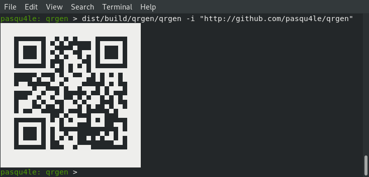

# QR code generator

`qrgen` is a simple haskell command line tool that generates a QR code from an input text and shows the result in the terminal or saves it into an Image File.



## Building

Before building you will need to install the C library [libqrencode](https://github.com/fukuchi/libqrencode), because it is required by [haskell-qrencode](https://hackage.haskell.org/package/haskell-qrencode).

Other libraries used:
- [hip](https://hackage.haskell.org/package/hip) to create and write an Image
- [optparse-applicative](https://hackage.haskell.org/package/optparse-applicative) to parse the command line arguments

You also need [GHC](https://www.haskell.org/ghc/) and [cabal-install](http://hackage.haskell.org/package/cabal-install). Then you can build with:

```
$ cabal build
```

## Usage
You can run: `qrgen --help` to read all the available options:

```
Simple QR code generator; outputs to Image File or Terminal

Usage: qrgen (-i|--input STRING) [-b|--border INT] [-s|--scale DOUBLE]
                ([-o|--output FILENAME] | [-p|--print])
  QR code generator

Available options:
  -i,--input STRING        Input text for the QR code
  -b,--border INT          Border size (1 or more suggested) (default: 3)
  -s,--scale DOUBLE        Scale the image by a factor (ignored by
                           terminal) (default: 10.0)
  -o,--output FILENAME     Write result to output image
  -p,--print               Write to terminal (default)
  -h,--help                Show this help text

```
